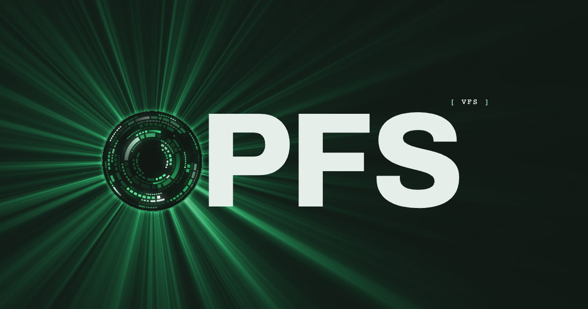

# OPFS VFS

A browser filesystem backed by the Origin Private File System, with POSIX-style file operations, write-ahead logging, crash recovery, and shared worker transport.

Use the core API from TypeScript or JavaScript, connect file-backed interfaces with the React SDK, or compose storage through the Effect v4 adapter. Volume Explorer and reusable file previews help you inspect and edit browser-local files. Ordinary filesystem use through the core package has no runtime dependencies.

New mounts default to disk buffering and balanced background synchronization. See [storage defaults](docs/API.md#storage-defaults) for save boundaries and switching buffer modes.



## Published packages

| Package                                                                                        | Purpose                                                                 | Documentation                                                  |
| ---------------------------------------------------------------------------------------------- | ----------------------------------------------------------------------- | -------------------------------------------------------------- |
| [@opfs-vfs/opfs-vfs](https://www.npmjs.com/package/@opfs-vfs/opfs-vfs)                         | Core filesystem, worker clients, and PGlite and just-bash adapters      | [Core guide](packages/opfs-vfs/README.md)                      |
| [@opfs-vfs/plugin-subscriptions](https://www.npmjs.com/package/@opfs-vfs/plugin-subscriptions) | Bounded file-change notifications                                       | [Subscriptions guide](packages/plugin-subscriptions/README.md) |
| [@opfs-vfs/react](https://www.npmjs.com/package/@opfs-vfs/react)                               | React providers, lifecycle hooks, and subscribed reads, in preview      | [React SDK guide](packages/react/README.md)                    |
| [@opfs-vfs/effect](https://www.npmjs.com/package/@opfs-vfs/effect)                             | Effect v4 scoped volumes, FileSystem service, and change streams        | [Effect adapter guide](packages/effect/README.md)              |
| [@opfs-vfs/devtools](https://www.npmjs.com/package/@opfs-vfs/devtools)                         | Volume Explorer with file actions, a shell, previews, and app debugging | [Volume Explorer guide](packages/devtools/README.md)           |
| [@opfs-vfs/file-preview](https://www.npmjs.com/package/@opfs-vfs/file-preview)                 | Reusable React file previews and a virtualized text editor              | [File preview guide](packages/file-preview/README.md)          |

The React SDK preview requires React 19. The Effect adapter requires stable `effect@4.0.0`; consumers must upgrade their Effect runtime to 4.0.0. See each package guide for installation and peer dependencies.

The private [website workspace](apps/website/README.md) contains marketing, docs, demos, and live benchmarks. It consumes the public packages through `workspace:*`; it is not published to npm. The [experimental DuckDB adapter](docs/DUCKDB.md) persists analytics databases through OPFS VFS using separately built, compatible DuckDB-Wasm assets.

## Development

Use Node.js 22.12 or newer and the pnpm version pinned in `package.json`.

```sh
pnpm install
pnpm --filter @opfs-vfs/opfs-vfs exec playwright install chromium
pnpm build
pnpm typecheck
pnpm test
pnpm lint
pnpm fmt:check
pnpm deadcode
```

Run `pnpm fmt` to format files and `pnpm duplicates` for an advisory duplication report. See [development](docs/DEVELOPMENT.md) for package commands and [API](docs/API.md) for the library exports.

## License

This working tree uses the source-available [PolyForm Noncommercial License 1.0.0](LICENSE.md). It permits noncommercial use, modification, and distribution. Commercial use requires separate permission from the copyright holder. The license is not OSI-approved open source.

See the [subscriptions package](packages/plugin-subscriptions/README.md) and [subscriptions API](docs/SUBSCRIPTIONS.md) for optional live file-change notifications.
